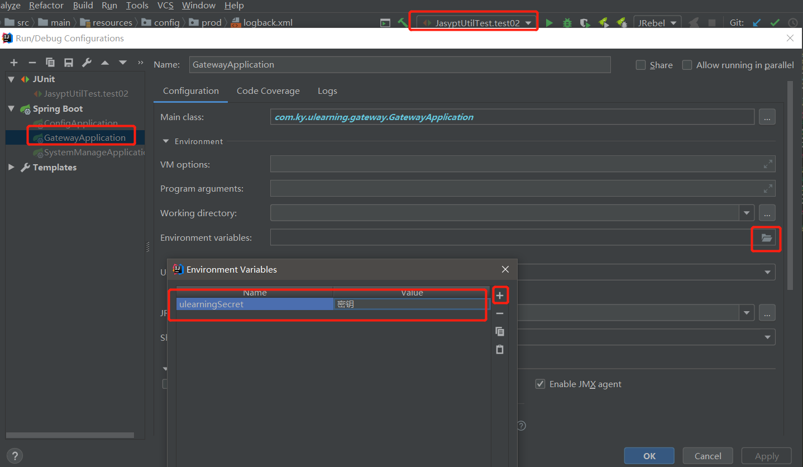

# 1、准备工作

具体的安装和使用说明不细述

1、mysql数据库

2、redis

3、fastdfs

4、数据库依次执行以下脚本：

- u-learning\文档\生产发布\1.0.0\升级脚本\ulearning.sql
- u-learning\文档\生产发布\1.0.1\修改脚本\u_teaching_task_ddl.sql
- u-learning\文档\生产发布\1.0.1\基础数据\u_permission_dml.sql

# 2、项目配置文件修改

【注】并非所有敏感配置都需要加密，若是本地环境的配置，则可以使用明文

1、使用随机工具，生成随机长度的密钥

2、密钥设置，两种方式：

- 将生成的密钥配置到环境变量中，key为ulearningSecret，value为生成的密钥。（使用cmd确保环境变量配置已生效）
- 

3、使用com.ky.ulearning.common.core.utils.JasyptUtilTest工具，对以下模块中的对应环境配置进行加密

| 模块                                                         |                                          | key                                          | 备注                                                         |
| ------------------------------------------------------------ | ---------------------------------------- | -------------------------------------------- | ------------------------------------------------------------ |
| ulearning-register                                           | config/local/application.yml             | spring.security.user.name                    | 注册中心账号                                                 |
| ulearning-register                                           | config/local/application.yml             | spring.security.user.password                | 注册中心密码                                                 |
| ulearning-gateway、 ulearning-monitor-manage、 ulearning-student、 ulearning-system-manage、 ulearning-teacher、 xxl-job-admin | config/local/bootstrap.yml               | eureka.instance.metadata-map.eureka.hostname | 注册中心ip                                                   |
| ulearning-gateway、 ulearning-monitor-manage、 ulearning-student、 ulearning-system-manage、 ulearning-teacher、 xxl-job-admin | config/local/bootstrap.yml               | eureka.instance.metadata-map.user.name       | 注册中心账号                                                 |
| ulearning-gateway、 ulearning-monitor-manage、 ulearning-student、 ulearning-system-manage、 ulearning-teacher、 xxl-job-admin | config/local/bootstrap.yml               | eureka.instance.metadata-map.user.password   | 注册中心密码                                                 |
| xxl-job-admin                                                | config/dev/application.yml               | xxl.job.accessToken                          | xxl-job访问token                                             |
| ulearning-config                                             | config/master/local/monitor-manage.yml   | xxl.job.accessToken                          | xxl-job访问token                                             |
| ulearning-config                                             | config/master/local/monitor-manage.yml   | xxl.job.admin.addresses                      | xxl-job全路径，例http://127.0.0.1:14007/xxl-job-admin        |
| ulearning-config                                             | config/master/local/ulearning-common.yml | spring.mail.password                         | 邮箱密码                                                     |
| ulearning-config                                             | config/master/local/ulearning-common.yml | jwt.secret                                   | 访问token密钥，随机生成即可                                  |
| ulearning-config                                             | config/master/local/ulearning-common.yml | fdfs.reqHost                                 | fastdfs访问ip                                                |
| ulearning-config                                             | config/master/local/ulearning-common.yml | fdfs.tracker-list                            | fastdfs访问ip端口，例127.0.0.1:22122                         |
| ulearning-config                                             | config/master/local/ulearning-jdbc.yml   | spring.datasource.druid.url                  | 数据库路径，例jdbc:mysql://127.0.0.1:3306/ulearning_dev?serverTimezone=Asia/Shanghai&characterEncoding=utf8&useSSL=false |
| ulearning-config                                             | config/master/local/ulearning-jdbc.yml   | spring.datasource.druid.username             | 数据库账号                                                   |
| ulearning-config                                             | config/master/local/ulearning-jdbc.yml   | spring.datasource.druid.password             | 数据库密码                                                   |
| ulearning-config                                             | config/master/local/ulearning-jdbc.yml   | spring.redis.host                            | redis访问ip                                                  |
| ulearning-config                                             | config/master/local/ulearning-jdbc.yml   | spring.redis.port                            | redis访问端口                                                |
| ulearning-config                                             | config/master/local/ulearning-jdbc.yml   | spring.redis.password                        | redis访问密码，无密码为空即可                                |
| ulearning-config                                             |                                          |                                              |                                                              |

# 3、项目启动

项目启动时，必须依次启动ulearning-register、ulearning-config和ulearning-gateway服务

后续根据实际需要启动其他服务