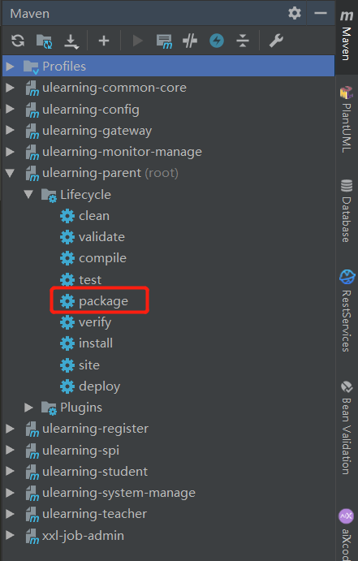

# 1、生产环境配置修改

对项目prod的配置进行修改，具体修改方式同《服务端开发手册》

# 2、项目打包

## 2.1 服务端打包

使用idea自带maven打包命令，完成后会在D:\Mydata\Major\java\develop\u-learning\shell路径下生成所有服务jar包



## 2.2 前端打包

1、安装nodejs环境

2、依次进入ulearning-admin、ulearning-student和ulearning-teacher根目录，执行npm run build:prod。将在根目录下生成dist目录，复制出来并重命名为项目名

# 3、安装部署

1、上传服务端、前端包和脚本到服务器中

2、修改startup.sh脚本，将eureka.instance.hostname修改为服务器出口ip

3、执行startup脚本，查看/tmp/ulearning-logs/xxx/sys下的日志文件，检查是否启动成功

# 4、nginx配置

修改nginx配置，ulearning配置如下：

```conf
    server{
		listen		80;
		server_name	tomcat;

        client_max_body_size 600m;
        client_body_buffer_size 1024k;
        client_header_buffer_size 1024k;
        large_client_header_buffers 4 8k;
        client_body_temp_path /tmp/cache/nginx/cache/temppath;
        # fastcgi_buffer_size 128k;
        # fastcgi_buffers 8 128k;
        # fastcgi_busy_buffers_size 128k;
        # fastcgi_temp_file_write_size 128k;
        client_header_timeout       600;
        client_body_timeout         600;
        proxy_connect_timeout       600;
        proxy_send_timeout          600;
        proxy_read_timeout          600;
        send_timeout                600;
        sendfile on;
        keepalive_timeout 1800;

        location /ulearning-admin {
            root 包路径;
            index  $uri/index.html;
            try_files $uri $uri/ /index.html;
        }
        
        location /ulearning-student {
            root 包路径;
            index  $uri/index.html;
            try_files $uri $uri/ /index.html;
        }
        
        location /ulearning-teacher {
            root 包路径;
            index  $uri/index.html;
            try_files $uri $uri/ /index.html;
        }

		location /server/ {
			proxy_pass http://ip:8082/;
			proxy_set_header  Host              $host;   # required for docker client's sake
	        proxy_set_header  X-Real-IP         $remote_addr; # pass on real client's IP
			proxy_set_header  X-Forwarded-For   $remote_addr;
			proxy_connect_timeout 300s;
			proxy_send_timeout 300s;
			proxy_read_timeout 300s;
		}

		location /monitor-manage {
	        proxy_pass http://ip:8082/monitor-manage;
	        proxy_set_header  Host              $host;   # required for docker client's sake
	        proxy_set_header  X-Real-IP         $remote_addr; # pass on real client's IP
	        proxy_set_header  X-Forwarded-For   $remote_addr;
			proxy_connect_timeout 300s;
			proxy_send_timeout 300s;
			proxy_read_timeout 300s;
	    }
    }
```

